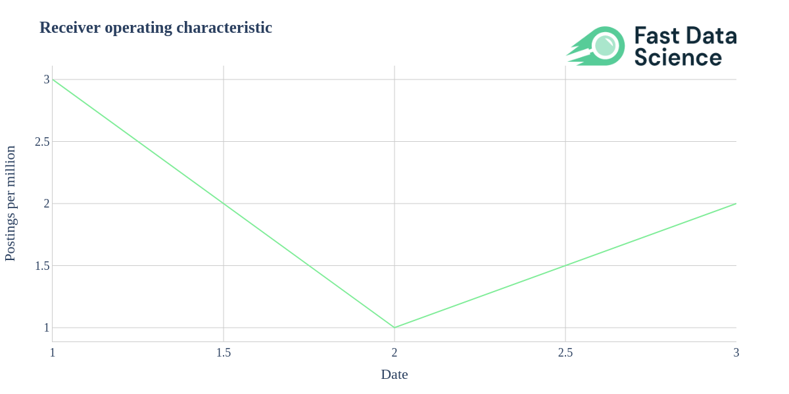
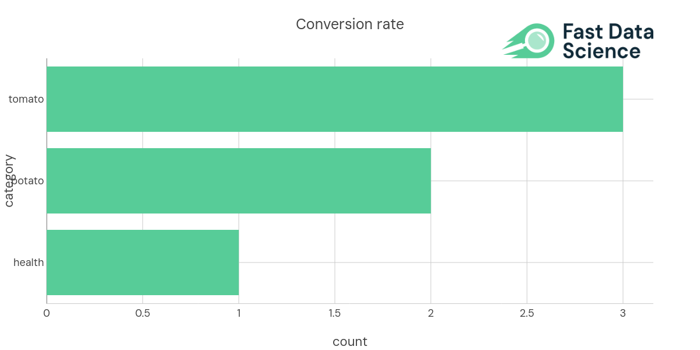
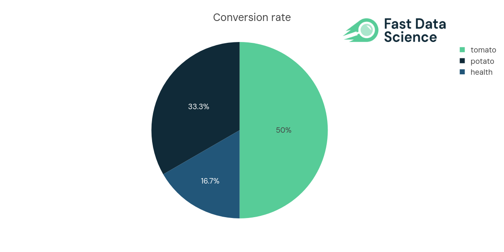

# Python library to produce Fast Data Science branded graphs in Plotly

## Installation

```
pip install .
```

## Usage

### Light theme

```
import fastdatascience

import plotly.express as px
fig = px.line(x=[1,2,3], y=[3,1,2],
                title="<b>Receiver operating characteristic</b>")

fastdatascience.brand(fig)

fig.show(renderer="png")
```



### Bar chart example

```
import fastdatascience
import pandas as pd
import plotly.express as px

df = pd.DataFrame({"category":["health", "potato", "tomato"], "count":[1, 2, 3]})

fig = px.bar(data_frame=df, x="count", y="category", title="Conversion rate",
                   color_discrete_sequence=fastdatascience.colour_sequence
                  )

fastdatascience.brand(fig)

fig.show(renderer="png")
```



### Histogram example

```
import fastdatascience
import pandas as pd
import plotly.express as px

df = pd.DataFrame({"conversion_rate":[0.1,0.2,0.3], "is_offer":[0,0,1]})

fig = px.histogram(data_frame=df, x="conversion_rate", color="is_offer", title="Conversion rate",
                   color_discrete_sequence=fastdatascience.colour_sequence
                  )

fastdatascience.brand(fig)

fig.show(renderer="png")
```


### Pie example

```
import fastdatascience
import pandas as pd
import plotly.express as px

df = pd.DataFrame({"category":["health", "potato", "tomato"], "count":[1, 2, 3]})

fig = px.pie(data_frame=df, values="count", names="category", title="Conversion rate",
                   color_discrete_sequence=fastdatascience.colour_sequence
                  )

fastdatascience.brand(fig)

fig.show(renderer="png")
```


